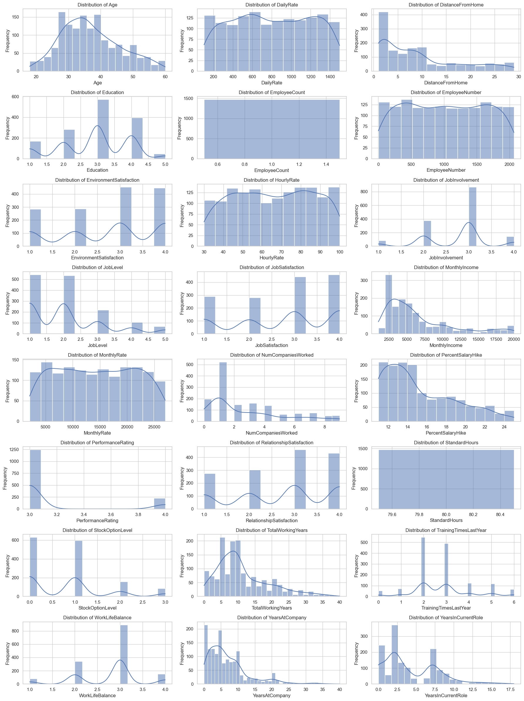
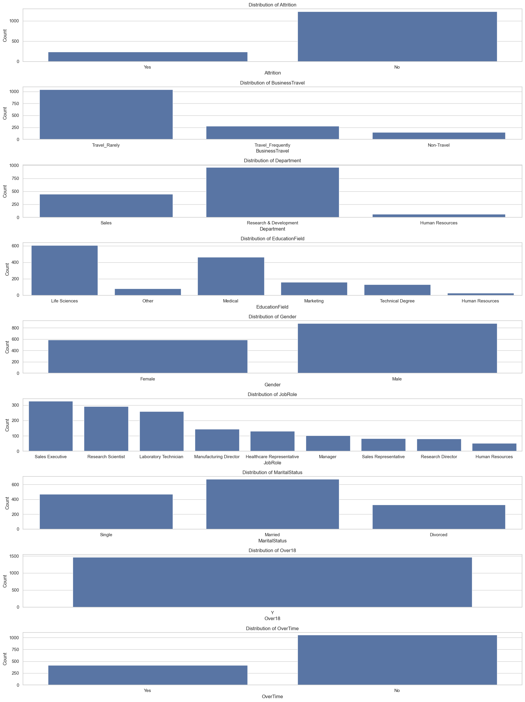
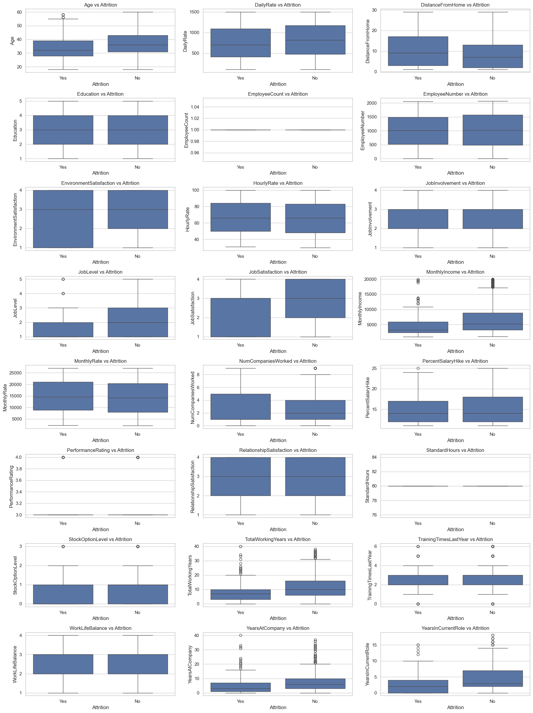
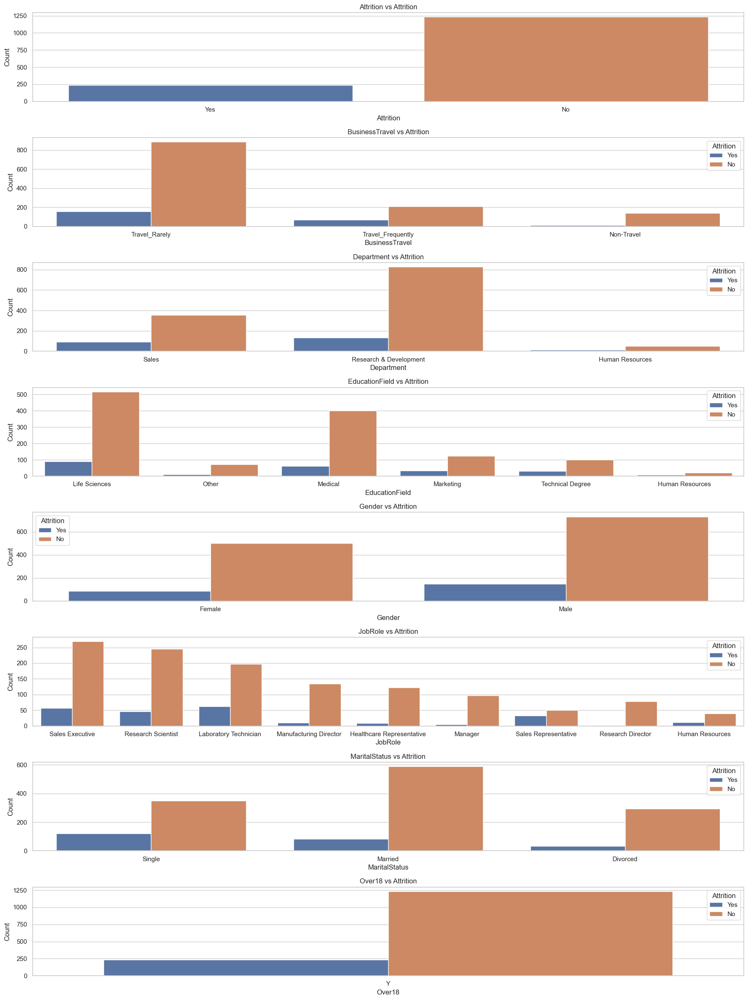
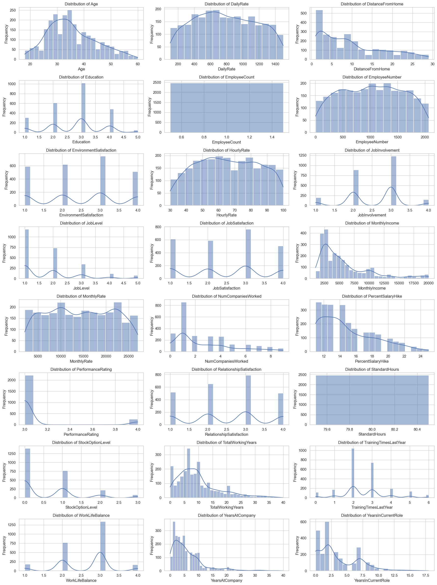
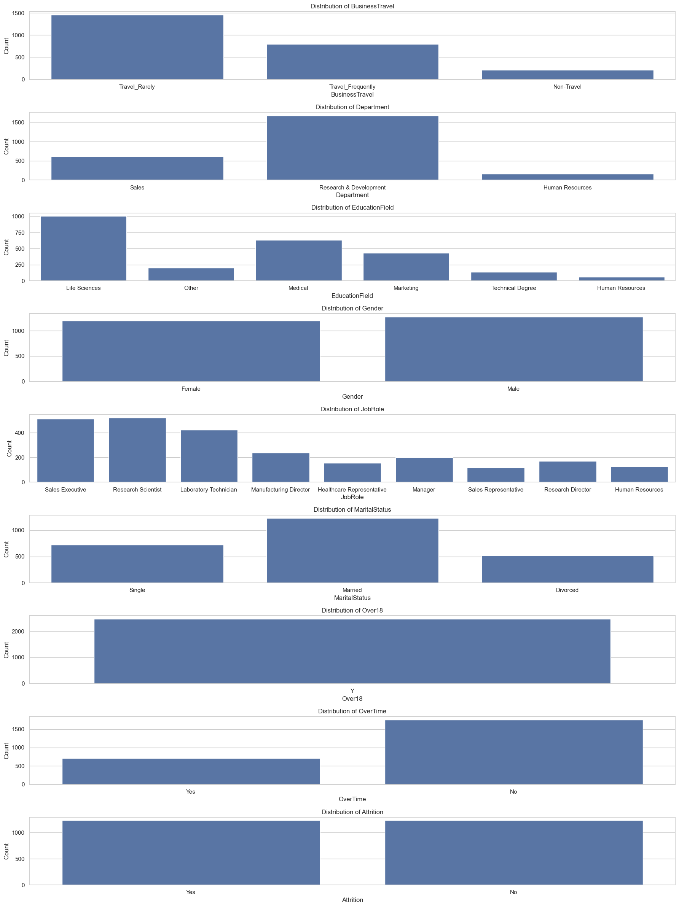
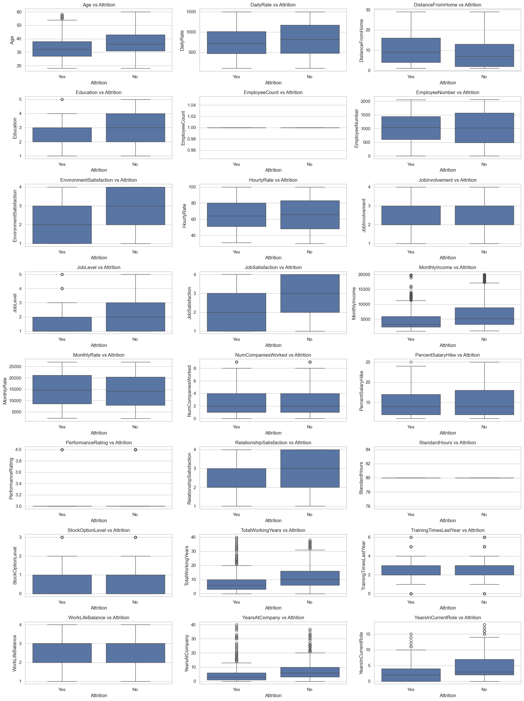

# HKBU-FIN7830-GP
## Dataset Citation
```
Karanth, M. (2020). Tabular summary of HR analytics dataset. [Data set]. Zenodo. https://doi.org/10.5281/zenodo.4088439
```
## Dataset Load

```python
# Read Dataset
import pandas as pd

# Load the dataset
file_path = 'Resources/Data/HR_Analytics.csv.csv'
df = pd.read_csv(file_path)

# Show some basic information about the dataset
df.info(), df.head()
```

# 数据结构
由于数据偏差，考虑使用SMOTE算法平衡数据
## 使用第三方库进行平衡
```python
from imblearn.over_sampling import SMOTE
from sklearn.preprocessing import LabelEncoder

# Encoding categorical variables
label_columns = df.select_dtypes(include=['object']).columns
label_encoder = LabelEncoder()

for column in label_columns:
    df[column] = label_encoder.fit_transform(df[column])

# Separate features and target variable
X = df.drop('Attrition', axis=1)
y = df['Attrition']

# Apply SMOTE
smote = SMOTE(random_state=42)
X_resampled, y_resampled = smote.fit_resample(X, y)

# Check the distribution of the target variable after SMOTE
y_resampled.value_counts()
```

## 无第三方库，纯算法平衡
```python
from sklearn.neighbors import NearestNeighbors
from sklearn.preprocessing import LabelEncoder
import numpy as np

df = pd.read_csv(file_path)
label_columns = df.select_dtypes(include=['object']).columns

def manual_SMOTE(X, y, target_label, k_neighbors=5, random_state=None):
    np.random.seed(random_state)

    # Filter minority class samples
    minority_samples = X[y == target_label]

    # Create a nearest neighbors model
    nn_model = NearestNeighbors(n_neighbors=k_neighbors + 1)
    nn_model.fit(minority_samples)

    # Find k neighbors for each sample in the minority class
    neighbors = nn_model.kneighbors(minority_samples, return_distance=False)[:, 1:]

    # Generate synthetic samples
    num_synthetic_samples = X[y != target_label].shape[0] - minority_samples.shape[0]
    synthetic_samples = np.zeros((num_synthetic_samples, X.shape[1]))

    for i in range(num_synthetic_samples):
        # Randomly choose a sample from minority class
        sample_idx = np.random.randint(0, minority_samples.shape[0])

        # Randomly choose one of its k neighbors
        neighbor_idx = np.random.choice(neighbors[sample_idx])

        # Compute the difference between the sample and its chosen neighbor
        diff = minority_samples.iloc[neighbor_idx] - minority_samples.iloc[sample_idx]

        # Generate a random number between 0 and 1
        random_weight = np.random.random()

        # Generate synthetic sample
        synthetic_samples[i] = minority_samples.iloc[sample_idx] + random_weight * diff

    # Combine the original features with synthetic samples
    X_resampled = pd.concat([X, pd.DataFrame(synthetic_samples, columns=X.columns)], ignore_index=True)
    y_resampled = pd.concat([y, pd.Series([target_label] * num_synthetic_samples)], ignore_index=True)

    return X_resampled, y_resampled

label_encoder = LabelEncoder()
for column in label_columns:
    df[column] = label_encoder.fit_transform(df[column])

X = df.drop('Attrition', axis=1)
y = df['Attrition']

# Apply manual SMOTE
target_label = 1  # 'Yes' label is encoded as 1
X_resampled, y_resampled = manual_SMOTE(X, y, target_label, random_state=42)

# Check the distribution of the target variable after SMOTE
y_resampled.value_counts()
```

# 数据可视化结果
## 原数据-数值型变量可视化

## 原数据-分类型变量可视化

## 原数据-数值型变量与Attrition的关系

## 原数据-分类型变量与Attrition的关系

## 平衡后数据-数值型变量可视化

## 平衡后数据-分类型变量可视化

## 平衡后数据-数值型变量与Attrition的关系

## 平衡后数据-分类型变量与Attrition的关系


# 逻辑回归
Wait for Write

# 神经网络
使用Tensorflow构建神经网络
```python
# 需要导入图的库
from tensorflow.keras.models import Sequential
from tensorflow.keras.layers import Dense, Dropout
from tensorflow.keras import regularizers
from sklearn.model_selection import train_test_split
from sklearn.preprocessing import StandardScaler
from sklearn.metrics import accuracy_score
import matplotlib.pyplot as plt
```

``` python
# 定义模型结构
model = Sequential([
    Dense(64, activation='relu', input_shape=(X_train.shape[1],), kernel_regularizer=regularizers.l1_l2(l1=0.01, l2=0.01)),
    Dropout(0.5),
    Dense(32, activation='relu', kernel_regularizer=regularizers.l2(0.01)),
    Dropout(0.5),
    Dense(16, activation='relu'),
    Dense(1, activation='sigmoid')
])
```
## 考虑加入L1/L2正则化
```python
from tensorflow.keras import regularizers
Dense(64, activation='relu', kernel_regularizer=regularizers.l1(0.01))
```
## 加入DropOut层
```python
from tensorflow.keras.layers import Dropout
model.add(Dropout(0.5))
```
## 加入正则化和Dropout后的模型结构
```python
model = Sequential([
    # 第一层: 输入层，不需要正则化或 Dropout
    Dense(64, activation='relu', input_shape=(X_train.shape[1],)),
    
    # 第二层: 隐藏层，添加 L1/L2 正则化
    Dense(64, activation='relu', kernel_regularizer=regularizers.l1_l2(l1=0.01, l2=0.01)),
    
    # 添加 Dropout 层
    Dropout(0.5),
    
    # 第三层: 隐藏层，添加 L2 正则化
    Dense(32, activation='relu', kernel_regularizer=regularizers.l2(0.01)),
    
    # 添加 Dropout 层
    Dropout(0.5),
    
    # 输出层: 通常不需要正则化或 Dropout
    Dense(1, activation='sigmoid')
])
```

## 可视化神经元
```python
import matplotlib.pyplot as plt

history = model.fit(X_train, y_train, epochs=20, batch_size=32, validation_split=0.2)

# Plot training & validation accuracy values
plt.plot(history.history['accuracy'])
plt.plot(history.history['val_accuracy'])
plt.title('Model accuracy')
plt.ylabel('Accuracy')
plt.xlabel('Epoch')
plt.legend(['Train', 'Test'], loc='upper left')
plt.show()
```
## 使用Adam优化器
```python
model.compile(optimizer='adam', loss='binary_crossentropy', metrics=['accuracy'])
```

## 获得模型所有层权重
```python
for i, layer in enumerate(model.layers):
    weights = layer.get_weights()[0]
    biases = layer.get_weights()[1]
    print(f"Layer {i} - Weights:\n{weights}, Biases:\n{biases}")
```
