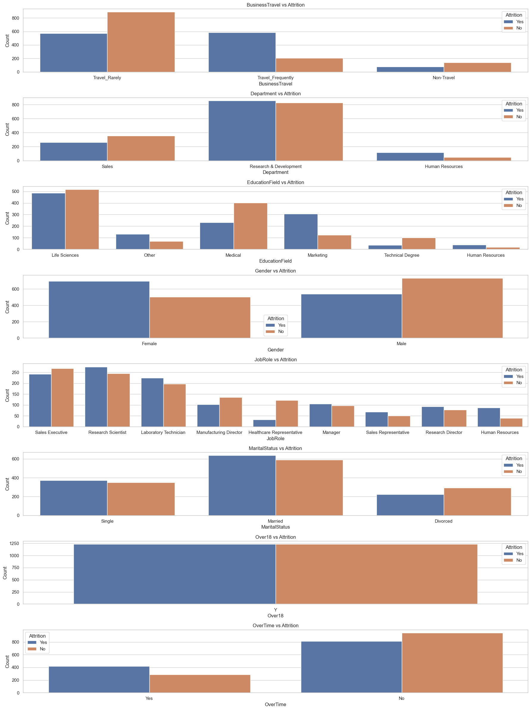

# HKBU-FIN7830-GP

## To Do List
- [ ] 清理数据集
- [x] 平衡数据集（使用SMOTE算法）
- [ ] 数据可视化（还需要更多）
- [ ] 逻辑回归模型（作为Baseline）
- [ ] 神经网络模型（当前最高准确率88.8%）

## Dataset Citation
```
Karanth, M. (2020). Tabular summary of HR analytics dataset. [Data set]. Zenodo. https://doi.org/10.5281/zenodo.4088439
```
## Dataset Load

```python
# Read Dataset
import pandas as pd

# Load the dataset
file_path = 'Resources/Data/HR_Analytics.csv.csv'
df = pd.read_csv(file_path)

# Show some basic information about the dataset
df.info(), df.head()
```
## /Resources/Data 文件说明
原数据集：[HR_Analytics.csv.csv](Resources%2FData%2FHR_Analytics.csv.csv)

编码后原数据集：[Encoded_HR_Analytics.csv](Resources%2FData%2FEncoded_HR_Analytics.csv)

平衡后编码数据集：[Encoded_Resampled_HR_Analytics.csv](Resources%2FData%2FEncoded_Resampled_HR_Analytics.csv)

平衡后解码数据集：[Decoded_Resampled_HR_Analytics.csv](Resources%2FData%2FDecoded_Resampled_HR_Analytics.csv)

数据集需要编解码的原因：
1. 原数据集中包含<kbd>Object</kbd>类项目，不能直接拿来建模（逻辑回归或神经网络）
2. SMOTE算法不支持对<kbd>Object</kbd>类进行扩充，需要转为<kbd>int</kbd>类
3. 为了方便进行可视化，需要对编码后的数据集进行解码，因为可视化中包含了<kbd>Object</kbd>的相关类

# 数据结构
## 数据平衡
由于数据偏差，考虑使用SMOTE算法平衡数据
### 使用第三方库进行平衡
参见<kbd>/DataBalance_Fix.py</kbd>

### 无第三方库，纯算法平衡
参见<kbd>/NotUse/SMOTE-Pure-Algrithm.py</kbd>

# 数据可视化结果
## 原数据-数值型变量可视化

## 原数据-分类型变量可视化

## 原数据-数值型变量与Attrition的关系

## 原数据-分类型变量与Attrition的关系

## 平衡后数据-数值型变量可视化

## 平衡后数据-分类型变量可视化

## 平衡后数据-数值型变量与Attrition的关系

## 平衡后数据-分类型变量与Attrition的关系


# 逻辑回归
## 实验性写法 (Pytorch)
### 基本信息
```
模型架构和参数：
LogisticRegressionModel(
(linear): Linear(in_features=34, out_features=1, bias=True)
)

权重与偏置：
权重: [[-0.09553184 -0.2081166  -0.07418099 -0.2123217   0.29514578 -0.30988827
  -0.01981156  0.04050073  0.05827003 -0.6642269  -0.20088294 -0.0848937
  -0.64710206 -0.6597117   0.2865685  -0.58003306 -0.19455934  0.23665671
  -0.04382532  0.259706    0.15341793  0.45419192 -0.08222049 -0.2576029
  -0.48684818 -0.02765574 -0.8174921  -0.36876386 -0.40666512 -0.45958838
   0.70300335 -0.4906797   0.46116477 -0.6617272 ]]
偏置: [-0.0540861]
```
### 公式
\ln\left(\frac{p}{1 - p}\right) = -0.0541 - 0.0955 \times \text{Age} - 0.2081 \times \text{BusinessTravel} - 0.0742 \times \text{DailyRate} - 0.2123 \times \text{Department} + 0.2951 \times \text{DistanceFromHome} - 0.3099 \times \text{Education} - 0.0198 \times \text{EducationField} + 0.0405 \times \text{EmployeeCount} + 0.0583 \times \text{EmployeeNumber} - 0.6642 \times \text{EnvironmentSatisfaction} - 0.2009 \times \text{Gender} - 0.0849 \times \text{HourlyRate} - 0.6471 \times \text{JobInvolvement} - 0.6597 \times \text{JobLevel} + 0.2866 \times \text{JobRole} - 0.5800 \times \text{JobSatisfaction} - 0.1946 \times \text{MaritalStatus} + 0.2367 \times \text{MonthlyIncome} - 0.0438 \times \text{MonthlyRate} + 0.2597 \times \text{NumCompaniesWorked} + 0.1534 \times \text{Over18} + 0.4542 \times \text{OverTime} - 0.0822 \times \text{PercentSalaryHike} - 0.2576 \times \text{PerformanceRating} - 0.4868 \times \text{RelationshipSatisfaction} - 0.0277 \times \text{StandardHours} - 0.8175 \times \text{StockOptionLevel} - 0.3688 \times \text{TotalWorkingYears} - 0.4067 \times \text{TrainingTimesLastYear} - 0.4596 \times \text{WorkLifeBalance} + 0.7030 \times \text{YearsAtCompany} - 0.4907 \times \text{YearsInCurrentRole} + 0.4612 \times \text{YearsSinceLastPromotion} - 0.6617 \times \text{YearsWithCurrManager}

# 神经网络
使用Tensorflow构建神经网络
```python
# 需要导入图的库
from tensorflow.keras.models import Sequential
from tensorflow.keras.layers import Dense, Dropout
from tensorflow.keras import regularizers
from sklearn.model_selection import train_test_split
from sklearn.preprocessing import StandardScaler
from sklearn.metrics import accuracy_score
import matplotlib.pyplot as plt
```

``` python
# 定义模型结构
model = Sequential([
    Dense(64, activation='relu', input_shape=(X_train.shape[1],), kernel_regularizer=regularizers.l1_l2(l1=0.01, l2=0.01)),
    Dropout(0.5),
    Dense(32, activation='relu', kernel_regularizer=regularizers.l2(0.01)),
    Dropout(0.5),
    Dense(16, activation='relu'),
    Dense(1, activation='sigmoid')
])
```
## 考虑加入L1/L2正则化
```python
from tensorflow.keras import regularizers
Dense(64, activation='relu', kernel_regularizer=regularizers.l1(0.01))
```
## 加入DropOut层
```python
from tensorflow.keras.layers import Dropout
model.add(Dropout(0.5))
```
## 加入正则化和Dropout后的模型结构
```python
model = Sequential([
    # 第一层: 输入层，不需要正则化或 Dropout
    Dense(64, activation='relu', input_shape=(X_train.shape[1],)),
    
    # 第二层: 隐藏层，添加 L1/L2 正则化
    Dense(64, activation='relu', kernel_regularizer=regularizers.l1_l2(l1=0.01, l2=0.01)),
    
    # 添加 Dropout 层
    Dropout(0.5),
    
    # 第三层: 隐藏层，添加 L2 正则化
    Dense(32, activation='relu', kernel_regularizer=regularizers.l2(0.01)),
    
    # 添加 Dropout 层
    Dropout(0.5),
    
    # 输出层: 通常不需要正则化或 Dropout
    Dense(1, activation='sigmoid')
])
```

## 可视化神经元
```python
import matplotlib.pyplot as plt

history = model.fit(X_train, y_train, epochs=20, batch_size=32, validation_split=0.2)

# Plot training & validation accuracy values
plt.plot(history.history['accuracy'])
plt.plot(history.history['val_accuracy'])
plt.title('Model accuracy')
plt.ylabel('Accuracy')
plt.xlabel('Epoch')
plt.legend(['Train', 'Test'], loc='upper left')
plt.show()
```
## 使用Adam优化器
```python
model.compile(optimizer='adam', loss='binary_crossentropy', metrics=['accuracy'])
```

## 获得模型所有层权重
```python
for i, layer in enumerate(model.layers):
    weights = layer.get_weights()[0]
    biases = layer.get_weights()[1]
    print(f"Layer {i} - Weights:\n{weights}, Biases:\n{biases}")
```
